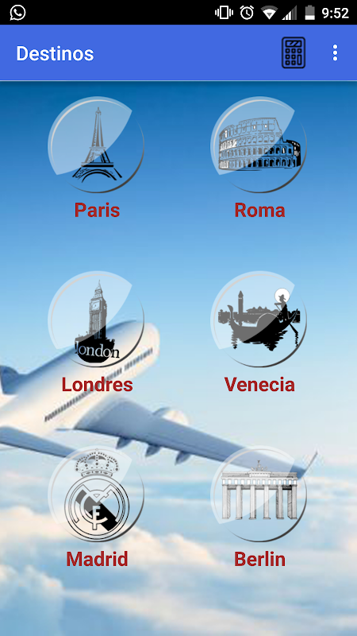
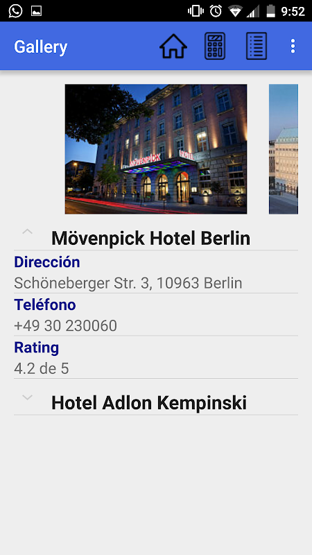

# EuroTravel Planner

Android travel app made as a final team project for an introductory Android programming college level class. Made in 2015 in the Dominican Republic, in Spanish.

The purpose of the project was to learn the app development lifecycle, from conception to publishing on the appstore; as well as learning to work as part of software team.

The purpose of this app is to convey valuable information for people interested in traveling to Europe. 

The information provided in app includes: cuisine, transportation, shopping, places, entertainment, hotels; as well as providing a currency calculator. 

The current cities available are: Paris, Rome, London, Venice, Madrid, Berlin.

